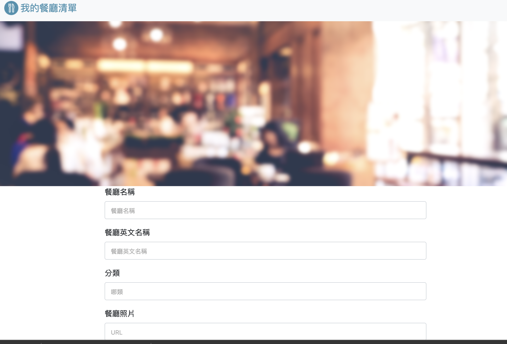

# Restaurant
一個以後端框架：Express  以及資料庫： MongoDB  
做為練習工具的餐廳清單

### Feature
+ 使用者可以在首頁瀏覽所有餐廳
+ 使用者可以新增餐廳資料
+ 使用者可瀏覽特定餐廳詳細資料
+ 使用者可以修改餐廳資料
+ 使用者可以刪除不喜歡的餐廳資料
+ 使用者可以使用關鍵字，搜尋餐廳名稱、類別
+ 使用者可以透過下拉式選單，依照不同選擇排序
+ 使用者可以創建帳號
+ 使用者可以使用 Facebook、Google 帳號登錄
+ 使用者密碼已雜湊

### Environment
+ Node.js
+ npm
+ Express
+ MongoDB
+ mongoose
+ session
+ passport
+ bcryptjs
+ connect-flash
+ nodemon

  
### Installation
1. 複製專案 URL 並貼到 terminal 
  ```
  git clone https://github.com/rayray1010/restaurant.git
  ```
2. 安裝相依套件
  ```
  npm install
  ```
3. 跑幾筆種子資料寫入資料庫
 ```
npm run seed
 ```
4. 運行專案
```
npm run dev
```
## Example
### 首頁

### 創建頁面

### 詳細資料頁面

### 登錄頁面

